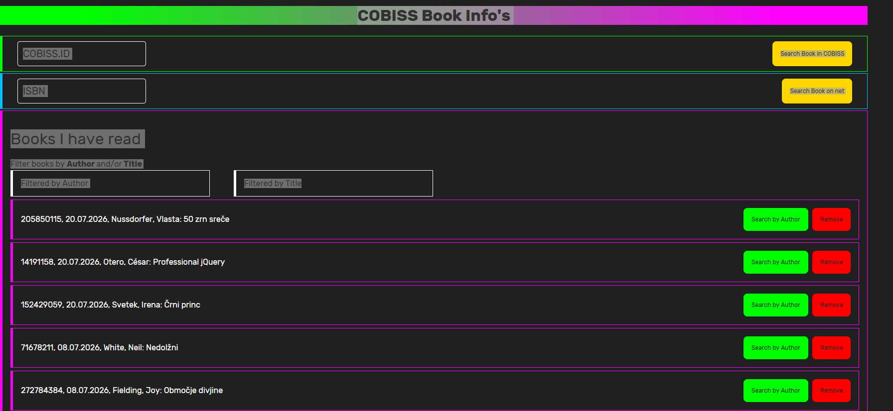
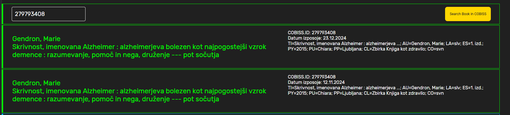
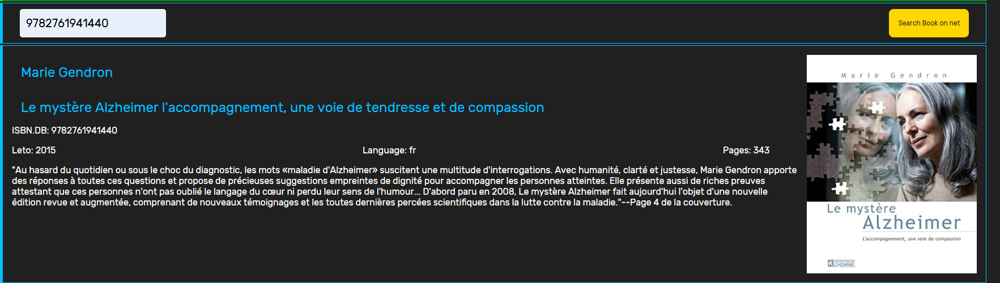
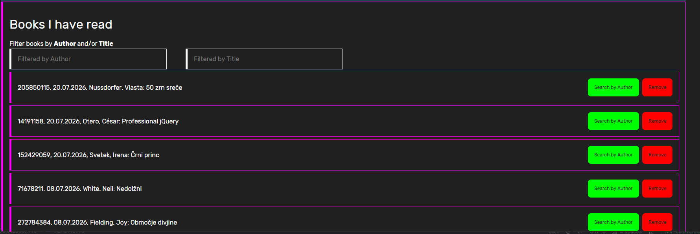
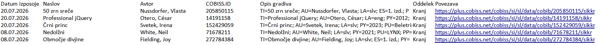

# COBISS_BookInfo aplikacija

Zasnovana je tako, da najprej v bazo sikkr.json pogledaš, če si to knjigo že bral.

            iz svojega profila v knjižnici, dobiš sikkr.xlsx datoteko, ki jo pretvoriš v JSON zapis (opisano na koncu).

sikkr.json je potrebno shraniti v public/Data mapo. Nato v terminalu (v ločenem zavihku) startaš:
            
            json-server public/Data/sikkr.json

V terminalu startaš: 

    npn run dev, 

da se zažene VITE, ki naredi: http://localhost:5173 link za aplikacijo.

Ko greš z browserjem na ta link, se pojavi začetna stran aplikacije:

V zgornje polje COBISS.ID lahko vneseš cobiss.id številko, aplikacija ti pove kdaj si to knjigo že bral, ali pa, da je še nisi.

V polje ISBN lahko vneseš isbn številko (10 ali 13 mestno) aplikacija pa ti iz ISBN.DB portala prikaže podatke o tej knjigi.

V spodnjem delu pa je seznam vseh knjig ki si jih že prebral.

Če pritisneš gumb Search by Author, se izpišejo le knjige tega avtorja, ki si jih prebral.
Remove gumb pa trajno pobriše to knjigo iz seznama.
Lahko pa tudi sam vneseš avtorja in/ali naslov knjige, ki te zanima, aplikacija prikaže filtrirano vsebino, glede na vneseno.

# Pretvorba XLSX v JSON

To xlsx datoteko pretvorimo v JSON obliko. Lahko na sledečem linku:

     https://products.groupdocs.app/sl/conversion/xlsx-to-json

da dobimo to obliko:

    [
    {
    "Datum izposoje": "20.07.2026",
    "Naslov": "50 zrn sreče",
    "Avtor": "Nussdorfer, Vlasta",
    "COBISS.ID": "205850115",
    "Opis gradiva": "TI=50 zrn sreče; AU=Nussdorfer, Vlasta; LA=slv; ES=1. izd.; PY=2024; PU=Združenje gluhoslepih Slovenije Dlan; PP=Ljubljana; CO=svn",
    "Oddelek": "Kranj",
    "Povezava": "https:\/\/plus.cobiss.net\/cobiss\/si\/sl\/data\/cobib\/205850115\/sikkr"
    },
    {
    "Datum izposoje": "20.07.2026",
    "Naslov": "Professional jQuery",
    "Avtor": "Otero, César",
    "COBISS.ID": "14191158",
    "Opis gradiva": "TI=Professional jQuery; AU=Otero, César; LA=eng; PY=2012; PU=J. Wiley & Sons; PP=Indianapolis; CL=Wrox programmer to programmer; CO=usa",
    "Oddelek": "Kranj",
    "Povezava": "https:\/\/plus.cobiss.net\/cobiss\/si\/sl\/data\/cobib\/14191158\/sikkr"
    },
    
............................

    {
    "Datum izposoje": "09.01.2008",
    "Naslov": "Ko se spet vidimo",
    "Avtor": "Clark, Mary Higgins",
    "COBISS.ID": "119389184",
    "Opis gradiva": "TI=Ko se spet vidimo; AU=Clark, Mary Higgins; LA=slv; PY=2002; PU=Mladinska knjiga; PP=Ljubljana; CL=Zbirka Oddih; CO=svn",
    "Oddelek": "Kranj",
    "Povezava": "https:\/\/plus.cobiss.net\/cobiss\/si\/sl\/data\/cobib\/119389184\/sikkr"
    }
    ]

